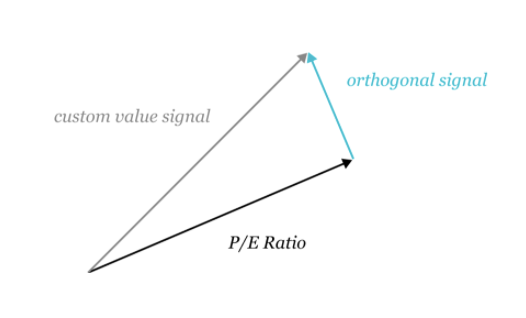

# 시그널스 소개

## 소개

[뉴머라이 시그널스](https://signals.numer.ai/tournament)는 전 세계 주식시장을 대상으로 한 경진대회입니다.

대회에 참여하신분들은 주식거래의 기반이 되는 signal (시그널)을 작성한뒤 제출하시면 뉴머라이는 모두의 시그널을 크라우드소싱을 이용해 메타모델을 작성해 헤지펀드의 운영에 사용되게 됩니다. 시그널스는 참가자들의 시그널이 얼마나 톡창적이고 우수한 시그널인지 비교할 수 있고 또 제출한 시그널의 성능의 따라 스테이킹 관계량에 비례한 NMR 토큰을 얻을 수 있습니다.

뉴머라이 시그널스 는 뉴머라이 헤지펀드를 구축하기 위해 사용되며 뉴머라이의 master plan (마스터플랜)의 일부입니다. [Medium Post](https://medium.com/numerai/building-the-last-hedge-fund-introducing-numerai-signals-12de26dfa69c)나 아래의 영상에서 상세한 내용이 설명되어 있습니다.



## **개요**

1. 뉴머라이 시그널스에 계정을 가입하거나 기존 뉴머라이 토너먼트 계정으로 가입하셔도 됩니다.
2. 대상이 된 주식시장에 대응한 시그널들을 업로드 하면 과거의 성능, 리스크 등 수익성을 진단할 수 있습니다.
3. 시행중인 라운드에 NMR을 스테이킹 하시면 시그널 제출 치의 성능 (`corr`과 `mmc`)에 근거해 NMR을 얻을 수 있습니다. 단 성능이 낮은 시그널들에 대해서는 NMR을 잃을 수도 있습니다.
4. 뉴머라이의 API에 직접 접속하여 매주 시그널스에 에측파일 제출을 자동화할 수 있습니다.

## **주식시장의 시그널이란?**

주식시장의 시그널이란 뉴머라이와 같은 quant (퀀트) 헤지펀드들이 포트폴리오를 구축하기 위하여 사용하는 데이터입니다.


주식시장 시그널의 예로는 다음과 같은 것이 있습니다.

* [펀더멘털 시그널](https://www.investopedia.com/terms/f/fundamentalanalysis.asp) ([P/E ratio](https://www.investopedia.com/terms/p/price-earningsratio.asp), [dividend yield](https://www.investopedia.com/terms/d/dividendyield.asp), [analyst ratings](https://www.investopedia.com/terms/r/rating.asp#:\~:text=A%20rating%20is%20conducted%20by,this%20action%20for%20the%20stock.))
* [테크니컬 시그널](https://www.investopedia.com/terms/t/technicalindicator.asp) ([MACD](https://www.investopedia.com/terms/m/macd.asp), [RSI](https://www.investopedia.com/terms/r/rsi.asp), [MFI](https://www.investopedia.com/terms/m/mfi.asp))
* [대안 데이터 시그널](https://en.wikipedia.org/wiki/Alternative\_data\_\(finance\)) ([신용카드 거래](https://secondmeasure.com), [위생이미지](https://www.theatlantic.com/magazine/archive/2019/05/stock-value-satellite-images-investing/586009/), [소셜미디어 감정](https://www.swaggystocks.com/dashboard/wallstreetbets/realtime))
* [혼합 시그널](https://www.investopedia.com/terms/m/multifactor-model.asp) ([Barra risk factors](https://www.investopedia.com/terms/b/barra-risk-factor-analysis.asp#:\~:text=The%20Barra%20Risk%20Factor%20Analysis%20is%20a%20multi%2Dfactor%20model,turnover%20and%20senior%20debt%20rating.), [Fama French factors](https://www.investopedia.com/terms/f/famaandfrenchthreefactormodel.asp))

이런 시그널들을 작성하기 위해 사용되는 기초데이터는 여러 성질을 가질 가능성이 높습니다. 예를 들면 주식회사의 연결재무제표와 그회사의 주차장의 이미지는 전혀 다른 데이터입니다만 미래의 주식 값을 예측하는 지표가 포함되어 있을지도 모릅니다. 뉴머라이가 참가자 데이터를 이용하기 위해서는 규격화가 필요합니다. 참가자는 티커와 시그널 데이터가 일대일로 대응할 수 있도록 목록을 작성해야 합니다.

## **시그널 작성법**

### **데이터와 툴**

자체 시그널을 작성하기 위해서는 먼저 여러 주식시장의 데이터를 가져와야 합니다.


주식시장의 데이터를 접하기 어려우시다면 [뉴머라이 토너먼트](../numerai-tournament/tournament-overview.md)에 참여해 주세요.


아직 주식시장의 데이터에 접하지 못한 경우 [Yahoo Finance](https://finance.yahoo.com), [Quandl](https://www.quandl.com), [Koyfin](https://www.koyfin.com) 등 인터넷상에 무료 또는 저렴한 데이터 공급자가 다수 존재합니다.

또한 [Quantopian](https://www.quantopian.com), [QuantConnect](https://www.quantconnect.com), [Alpaca](https://alpaca.markets)와 같은 시그널 데이터를 쉽게 만들 수 있는 플랫폼도 있습니다. 특히 [Risk Model](https://www.quantopian.com/risk-model)과 [AlphaLens Tearsheets](https://www.quantopian.com/tutorials/alphalens#lesson1)는 시그널의 품질을 분석하는데 가장 적합한 방법입니다. 저희 커뮤니티에서 사용되고 있는 인기 있는 데이터 소스, 플랫폼, 툴 리스트는 [이 게시판 thread](https://forum.numer.ai/t/free-or-cheap-data-for-erasure-numerai-quant/350)를 체크하시기 바랍니다.


독특하고 차별화된 데이터셋을 찾아 사용하는 것이 독창적인 시그널을 만들어내는 열쇠입니다.


### **유니버스 (대상 주식)**

유니버스는 세계의 상위 5,000개의 대형주를 포함하고 있습니다. 유니버스는 매주 갱신됩니다만 갱신 대상이 되는 것은 거래량이 적은 몇 종목 뿐입니다.

최신 유니버스는 [latest universe file](https://numerai-signals-public-data.s3-us-west-2.amazonaws.com/universe/latest.csv)을 다운로드 받아 볼 수 있습니다.

과거의 유니버스 정보는 [historical targets file](https://numerai-signals-public-data.s3-us-west-2.amazonaws.com/signals\_train\_val\_bbg.csv) 다운로드 받아 보실 수 있습니다. 이 파일에는 `target_4d`와 `target_20d`의 두 개의 대상 컬럼이 있습니다. `target_20d`가 점수 매기기 및 지불을 위해 시그널이 평가 되는 대상입니다.

`target_4d`와 `target_20d`의 값은 라운드 오픈에서 각각 11일과 33일 후에 표기 됩니다. `target_4d`과는 달리 `target_20d`는 확인 되는 데 더 오래 걸리므로 가장 최근의 날짜의 `target_20d`은 `NaN` 값을 갖습니다.

### **시그널 제출**

작성한 데이터를 뉴머라이 시그널스에 제출할 때는 최소 2개의 컬럼을 포함해야 합니다.

* `cusip`, `sedol` 또는 `bloomberg_ticker`열 - 값은 헤더의 ticker 유형과 관련된 활성 티커여야 합니다.
* `signal` 열-값은 0에서 1 사이여야 합니다. (0,1 제외)

또한, 유효한 제출을 하기 위해서는

* 현재 `live` 기간 예측을 포함하는 행이 최소 10 줄이어야 합니다.
* 현재 `live` 기간에는 티커가 두 번 이상 나타날 수 없습니다.

두 줄만 예측한 결과는 현재 `live` 시간대를 지원한다고 가정합니다.

또한 signal 파일을 제출하면 과거의 퍼포먼스, 리스크, 잠재적인 수익에 대한 진단을 할 수 있습니다. 검증 기간은 20130104 부터 입니다.

검증기간을 포함한 예측결과에는 `friday_date`, `data_type`열을 포함해야 합니다.

* `friday_date` 열 - 뉴머라이 시그널스에서는 라운드의 시작이 금요일이기 때문에 금요일에 해당하는 날짜를 쓰셔야 합니다.
* `data_type` 열 - 값은 `live` 또는 `validation`만을 취할 수 있습니다. `data_type`이 `live`인 행에는 가장 최근 금요일 날짜가 포함되어 있어야 합니다.

.png>)

최신의 제출예는 [이 링크](https://numerai-signals-public-data.s3-us-west-2.amazonaws.com/example\_signal/latest.csv)를 통해 다운로드 할 수 있습니다.

### **시그 진단**

시그널 데이터를 제출하면 과거의 성능, 리스크, 잠재적인 수익을 진단할 수 있습니다. 이 절차는 보통 제출파일에 포함되어 있는 주 수와 티커 수에 따라 10\~15분 정도 소요됩니다.


이러한 진단을 이용하면 NMR을 스테이킹 할 가치가 있는지를 평가할 수 있습니다. 단 과거의 검증기간 중에 높은 퍼포먼스가 나온 시그널은 현재 또는 미래의 라운드에서 좋은 점수를 얻지 못할 수 있다는 점에 주의해야 합니다.


이 진단 툴을 반복적으로 사용하면 바로 overfitting(과적합)으로 연결됩니다. 진단 툴은 시그널 데이터 작성 과정에 최종 점검으로만 사용하는걸 추천합니다.


진단을 계산할 때 사용한 과거의 타겟은 모두 [이 파일](https://numerai-signals-public-data.s3-us-west-2.amazonaws.com/signals\_train\_val\_bbg.csv)에서 찾을 수 있습니다.

### **제출 자동화**


최신 시그널 데이터를 매주 뉴머라이에 제출해야 합니다.


[Numerai-CLI](https://docs.numer.ai/tournament/compute), [GraphQL API](https://api-tournament.numer.ai), 공식 python 클라이언트를 사용하여 제출 절차를 자율화할 수 있습니다.



## 시그널스 평가방법

### **중화**

뉴머라이는 기존의 다양한 시그널 데이터를 가지고 있습니다. 그 중에는 Barra 팩터 (사이즈, 가치, 모멘텀 등), 국가 및 섹터의 리스크 팩터, 주식별 특징 등이 포함되어 있습니다.


“중화”를 정의하자면 제출된 시그널 (타겟)은 Barra 팩터, 국가 및 섹터의 팩터, 기타 주식별 특징 등 뉴머라이의 기존 시그널과의 상관관계가 0이 되도록 변환된것을 뜻합니다.


뉴머라이 시그널스에 업로드된 모든 시그널 데이터는 평가가 되기 전에 중화됩니다. 중화의 핵심은 기존의 시그널에 존재하지 않는 새로운 시그널의 자체 성분 혹은 orthogonal (직교) 성분을 분리하는 것입니다.




잘 알려진 몇 가지 시그널의 단순한 선형합된 수치를 제출하면 중화 후에 직교 성분이 거의 남지 않습니다.


시그널을 평가하기 위해 사용되는 타겟도 중화됩니다. 타겟은 실질적으로는 뉴머라이 커스텀의 '특정 리턴' 또는 '잔류 리턴'입니다.

중화를 실행하는데 사용되는 데이터는 제공되지 않으므로 이 프로세스는 "블랙박스"로 운영 됩니다. 단, 과거 기간에 강한 스코어를 갖는 시그널은 현재의 라운드든 미래의 라운드에 좋은 평가를 얻지 못할 수 있다는 점에 주의해야 합니다. 시그널의 과거의 진단을 사용하여 중화가 미래 시그널에 미치는 영향을 추정할 수 있습니다.

중화를 시행하기 위해서 사용되고 있는 코드는 오픈 소스입니다. 중화 과정은 이 노트북에서 자세히 볼 수 있습니다.



혹은 특징 변수와 중화 절차의 보다 넓은 의미를 이해하기 위해 이 게시판의 글(영어)을 참조해 보시기 바랍니다.



후속 주식 리턴과의 상관성이 매우 높은 시그널는 뉴머라이 시그널스 안의 점수가 매우 낮고 후속 상관성이 낮은 시그널은 높은 점수를 낼 수도 있습니다.

다시 말하면 강한 예측치를 가진 좋은 시그널을 단독적으로 볼 경우 뉴머라이 시그널스에서는 평가가 낮을 수도 있습니다. 그럼으로 뉴머라이 안에서는 시그널 데이터의 독창적인 특징을 강조합니다. 뉴머라이 시그널스의 대회에서는 주식 리턴을 예측하는 것이 목표가 아니고 뉴머라이에는 없는 독창적인 자체 시그널을 찾는 것을 목표로 삼고 있습니다.

### **20일간의 중화 된 리턴 타겟**

시그널스는 뉴머라이에 의해 작성된 타겟에 대해 평가됩니다.

해당 타겟은 블랙박스화되어 있어 참가자들은 내용을 알 수 없습니다. 이 타겟은 22일간의 중화된 후속 리턴에 근거하고 있습니다. (첫 2일간은 제외)

시그널스가 20일 동안 평가되는 이유는 짧은 시간 축으로밖에 기능하지 않는 시그널은 대규모 헤지펀드가 구현할 수 없기 때문입니다. 예를 들어 시그널이 주식의 1시간 후 리턴을 정확하게 예측할 수 있다 하더라도 헤지펀드가 그 자리를 완전히 거래하는데 24시간이 걸린다면 그다지 유용하지 않습니다.

대규모 헤지펀드에 가장 유용한 시그널은 low-alpha decay (저알파 감쇠)라고도 불리는 긴 시간 축의 예측력을 가지고 있습니다.

정확한 날짜는 [주요 날짜와 마감](signals-overview.md#undefined-7) 섹션을 참조해 주세요.

### **스코어링**

평가되기 전에 시그널은 처음에 \[0, 1] 사이에 등급이 매겨지고 다음으로 중화됩니다. 마지막으로 중화된 시그널과 타겟 사이의 스피어먼 상관계수로 점수가 계산됩니다. 이 점수는 이 문서와 웹사이트에서는 단순히 `Corr`이라고 부르고 있습니다.

제출된 시그널은 스코어링전에 중화됩니다. 그렇게 함으로써 시그널과 타겟의 데이터를 규격화하고 타겟에 대한 퍼포먼스를 향상시킬 수 있습니다.

이 절차에서 타겟도 중화되고 중화에 사용되는 데이터는 뉴머라이가 제공하지 않습니다. 뉴머라이는 참가자로부터 얻은 시그널을 최적화하여 최고의 퍼포먼스의 포트폴리오를 얻을 수 있습니다.

예를 들어 시그널이 국가 리스크에 대해 중화되지 않은 데이터를 제출했다고 합시다. 이 경우 뉴머라이 시그널스는 평가 전에 국가 리스크에 대한 중화를 하기 때문에 국가 리스크의 영향은 없어집니다. 따라서 참가자는 각 팩터의 영향을 신경 쓰지 않고 독자적인 시그널 작성에 집중할 수 있습니다.

유니버스 일부 종목 (예: 미국주식 시그널)에 대해서만 시그널을 제출할 경우에도 뉴머라이 시그널스에 참여할 수 있습니다. 데이터가 없는 종목에 대해서는 등급이 매겨진 후 뉴머라이가 자동으로 중앙값으로 채워줍니다.

### **메타 모델에의 공헌**

`corr`은 제출한 시그널과 뉴머라이가 보유한 시그널 (타겟은 중화제)가 어느 정도 상관관계가 있는지를 나타내는 지표입니다. 한편 Meta Model Contribution (`mmc`)는 제출한 시그널가 뉴머라이가 보유한 Signals (타겟은 중화제)와의 상관관계를 가질 뿐만 아니라 다른 사람이 NMR을 이해관계한 시그널과도 상관관계를 갖고 계산한 지표입니다. 이 문서 및 웹사이트에서는 단순히 `mmc`라고 부르고 있습니다.

시그널의 `mmc`는 첫 번째 Signals' Meta Model이라고 불리는 특별한 Signals를 구축함으로써 계산됩니다.여기서 시그널스 메타 모델이란 주어진 라운드에 대해서 뉴머라이 시그널스 상의 모든(랭크 매겨지고 중화 된) 데이터의 스테이크 가중평균으로 정의된 것입니다. 시그널스의 `mmc`는 메타 모델에 중화된 이후 타겟에 대한 시그널의 상관관계를 나타내는 지표입니다.


참가자가 제출한 시그널이 높은 `mmc`를 나타낼 경우 다른 사람이 제출한 시그널보다 우위를 나타냅니다.


`mmc`는 뉴머라이 토너먼트에서 따온 개념으로 스코어링 시스템은 매우 유사합니다. 뉴머라이에서의 `mmc` 계산방법에 대한 자세한 내용은 뉴머라이 토너먼트 문서의 [메타 모델 공헌도](../numerai-tournament/meta-model-contribution-mmc.md) 섹션을 참조해 주세요.

뉴머라이 시그널스의 `mmc` 계산은 뉴머라이 토너먼트와 완전히 분리되어 있음에 유의하시기 바랍니다. 구체적으로는 뉴머라이 시그널스 에 제출하는 것만이 시그널스의 메타모델을 구축하는데 사용됩니다.

## **스테이킹**

제출한 시그널에 자신이 있는 경우 corr 또는 `corr` + `mmc`에 NMR을 스테이킹 할 수 있습니다. 스테이킹이란 NMR을 이더리움 블록체인의 스마트 컨트랙트에 고정하는 것을 의미합니다. 참가자들은 뉴머라이는 스테이킹된 NMR에 제출된 시그널의 퍼포먼스에 따라 더 많은 NMR을 얻거나 잃을 수 있습니다.

참가자들은 웹사이트에서 스테이킹 양을 관리할 수 있습니다. 스테이킹 금액을 늘리면 NMR은 지갑에서 스테이킹 컨트랙트 (뉴머라이가 보유한 ETH 계정)로 전송됩니다. 스테이킹을 줄이면 NMR은 약 4주 지연 후에 참가자 지갑에 다시 넣어집니다. 또한 스테이킹의 종류를 변경할 수도 있고 이를 통해 스테이킹 하고 싶은 스코어 (`corr`, `corr` + `mmc`)를 결정할 수 있습니다.



참가자분이 NMR을 시그널스에 스테이킹하는 것은 이하의 행위에 참여할 기회를 드리는 것이 아님에 주의해 주시기 바랍니다: 투자계약, 주식, 금융자산 리턴에 기초한 스와프, 뉴머라이 헤지펀드 참여, 뉴머라이 헤지펀드 이자, 뉴머라이 자체가 얻은 수수료 제공.

뉴머라이 시그널스는 참가자가 자신의 시그널의 가치를 평가할 수 있는 서비스입니다. 기본적으로 시그널스는 제출된 시그널 데이터가 가치가 있는 시그널 인지를 검증하는 방법으로 NMR 스테이킹을 사용합니다. 또한 페이아웃은 사용자에게 개시되지 않는 블랙박스 타겟에 근거하여 뉴머라이의 재량으로 이루어집니다.

페이를 받는 대가로 뉴머라이는 스테이킹된 시그널들과 관련 데이터를 뉴머라이 헤지펀드에서 사용 됩니다. 여기에 참가자분들은 시그널스에 다른 기대치를 갖고 NMR을 스테이킹 하셔는 안됩니다. 자세한 내용은 [이용약관](https://numer.ai/terms)을 읽어 주십시오.


## **페이아웃**

라운드당 얻을 수 있는 NMR 금액은 스테이킹 양과 그 라운드 예측치의 `corr`과 `mmc`의 수치에 결정 됩니다.

수치가 높으면 높을수록 더 많은 NMR을 얻을 수 있습니다. 만약 수치가 마이너스 Corr 또는 MMC가 되었을 경우 스테이킹 된 NMR의 일부가 소멸되어 burn (번)됩니다. 번은 ERC-20 토큰이 가진 기능 중 하나로 토큰을 영원히 사용할 수 없게 소멸되는 기능을 말합니다. 페이아웃 되는 NMR의 양은 스테이킹 금액의 ±25%로 제한하고 있습니다.

페이아웃은 이하의 공식으로 계산됩니다.

```
payout = stake_value * payout_factor * (corr * corr_multiplier + mmc * mmc_multiplier)
```

`stake_value`: 라운드 시작 시점의 첫 번째 목요일에 스테이킹 한 NMR의 금액

`payout_factor`: 10만 NMR 이하에서는 1이며 10만 NMR 이상에서는 이하의 차트에 나타내는 수치에 반영된 액수 가 되겠습니다. 뉴머라이는 페이아웃 상한선을 정하고 조정함으로써 지속적으로 토너먼트를 개최할 수 있습니다.


`corr`: 제출한 시그널과 뉴머라이 타겟의 상관계수

`corr_multiplier`: 현재는 2.0x 이외는 선택할 수 없습니다

`mmc`: 제출한 시그널과 메타모델과의 상관계수

`mmc_multiplier`: 현재 0.5x, 1.0x, 2.0x, 3.0x 중 하나를 선택할 수 있습니다.

| corr multiplier options | mmc multiplier options       |
| ----------------------- | ---------------------------- |
| 2.0x                    | 0.0x, 0.5x, 1.0x, 2.0x, 3.0x |


`payout_factor`의 수치나 `corr_multiplier`과 `mmc_multiplier`의 선택권은 뉴머라이에 결정에 의해 변경될 가능성이 있습니다.


페이아웃 계산의 예를 아래에 보겠습니다. 첫 두 줄은 mmc\_multiplier의 영향을 나타내고 있습니다. 세 번째 예시는 마이너스 스코어가 페이아웃에 영향을 미치는지 보여줍니다. 네 번째 예시는 페이아웃이 스테이크 양의 ±25%로 제한되어 있음을 보여줍니다.

| stake value | payout factor | corr  | corr multiplier | mmc   | mmc  multiplier | payout   |
| ----------- | ------------- | ----- | --------------- | ----- | --------------- | -------- |
| 100 NMR     | 0.8           | 0.02  | 2.0x            | 0.002 | 2.0x            | 3.52 NMR |
| 100 NMR     | 0.8           | 0.02  | 2.0x            | 0.002 | 0.0x            | 3.2 NMR  |
| 100 NMR     | 0.8           | -0.03 | 2.0x            | 0.002 | 0.5x            | -4.8 NMR |
| 100 NMR     | 0.8           | 0.15  | 2.0x            | 0.07  | 2.0x            | 25 NMR   |

### **스테이크량의 성장**

점수는 매일 갱신되지만 페이아웃은 종료일 (한국시간 목요일)에만 진행됩니다. 제출한 예측 파일이 양수의 `corr`, `mmc`를 계속 가지는 한 얻을 수 있는 NMR의 양은 증가 **** 합니다.&#x20;

모델이 52주 동안 매주 같은 점수를 받는다고 가정했을 때 증가하는 스테이킹 금액을 아래 그래프로 볼 수 있습니다.


## **주요 날짜와 마감**

### 데이터 날짜 vs 유효한 날짜

시그널스에는 두 가지 날짜가 있습니다.

* `data_date` - 주식 시장 데이터에 대응하는 날짜입니다. 모든 `data_date`는 그날의 시장 종가를 참고하며 시간은 포함되어 있지 않습니다. 예를 들어 제출파일의 `friday_date`열의 값은 `data_date`형입니다.
* `effective_date` - 시그널스에서 진행되는 액션 및 이벤트를 지원하는 날짜로 항상 UTC에서 지정된 시간을 포함할 수 있습니다. 시간대 및 주식시장 데이터 처리에 시간이 걸리기 때문에 `data_date`와 `effective_date` 사이에는 보통 지연이 발생합니다. 특별한 지정이 없는 한 본 웹사이트 및 본 문서에 기재되어 있는 날짜는 모두 `effective_date`형입니다.

### 라운드

제출, 스테이킹, 점수, 페이아웃은 알기 쉽게 라운드로 분류되어 있습니다.

새로운 라운드는 매주 토요일 18:00 UTC (한국시간 일요일 03:00 KST)에 시작합니다. 데이터 제출과 스테이킹 마감시간은 월요일 14:30 UTC (한국시간 월요일 23:30 KST) 입니다. 마감시간 안에 제출이 되지 않았을 경우 제출 된 파일이 평가되지 않으며 페이아웃에서도 배제 됩니다. 마감 후 이루어진 스테이킹 금액 변경은 다음 라운드에 적용됩니다.

마감시간 안에 제출된 시그널은 라운드 기간 중 \~4주 동안 점수가 매겨집니다. 월요일 마감 후 첫째 주 금요일부터 첫 점수를 받고 4주 후 목요일에 최종 점수를 받아 총 20번의 점수를 받게 됩니다.


라운드의 유니버스는 전 금요일 data\_date에 정의됩니다. 20일간의 스코어링과 페이아웃은 3day-2day 부터 22day-2day 째의 중화 리턴에 근거하고 있습니다. 시장 종료 후 데이터가 사용 가능해질 때까지는 2일의 렉이 있습니다. 예를 들어 22day-2day의 중화 리턴은 화요일의 시장 종료까지입니다만 이 데이터를 이용할 수 있게 되는 날은 목요일입니다.


## **리더보드**

NMR의 페이아웃은 라운드마다의 퍼포먼스에 좌우됩니다. 리더보드에 게재되는 평가나 순위는 20라운드분의 `corr`,`mmc` 의 가중평균치를 이용하고 있습니다.


## **도움요청**

도움이 필요하신가요?&#x20;

질문과 피드백은 [RocketChat](https://community.numer.ai/home) (영어) 또는 [Slack](https://join.slack.com/t/numerai-kr/shared\_invite/zt-1009d7ws3-hWRKdy8EkbSzwwzxaURlQw) (한국어)에 올려 주시기 바랍니다!
