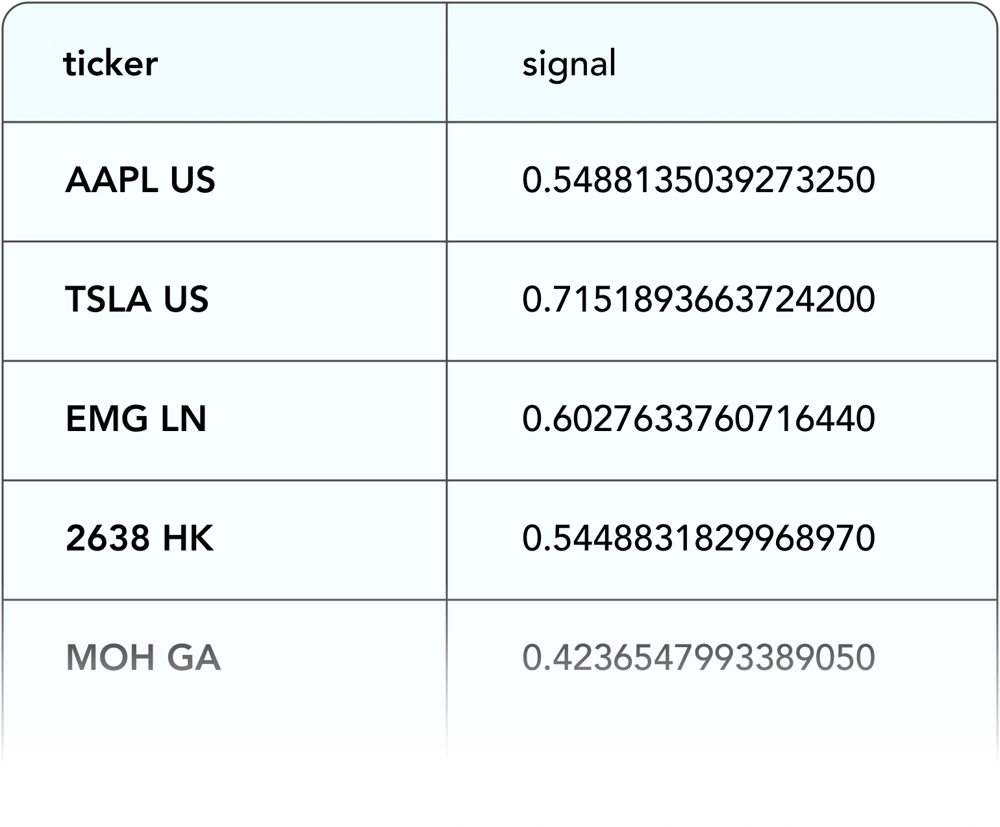

# 시그널스 소개

## 소개

[뉴머라이 시그널스](https://signals.numer.ai/tournament)는 전 세계 주식시장을 대상으로 한 경진대회입니다.

대회에 참여하신분들은 주식거래의 기반이 되는 signal (시그널)을 작성한뒤 제출하시면 뉴머라이는 모두의 시그널을 크라우드소싱을 이용해 메타모델을 작성해 헤지펀드의 운영에 사용되게 됩니다. 시그널스는 참가자들의 시그널이 얼마나 톡창적이고 우수한 시그널인지 비교할 수 있고 또 제출한 시그널의 성능의 따라 스테이킹 관계량에 비례한 NMR 토큰을 얻을 수 있습니다.

뉴머라이 시그널스 는 뉴머라이 헤지펀드를 구축하기 위해 사용되며 뉴머라이 마스터플랜의 일부입니다. [Medium Post](https://medium.com/numerai/building-the-last-hedge-fund-introducing-numerai-signals-12de26dfa69c)나 [short film](https://www.youtube.com/watch?v=GWeC2PK4yXQ\&feature=youtu.be)에서 상세한 내용이 설명되어 있습니다.



## **개요**

1. 뉴머라이 시그널스에 계정을 가입하거나 기존 뉴머라이 토너먼트 계정으로 가입하셔도 됩니다.
2. 대상이 된 주식시장에 대응한 시그널들을 업로드 하면 과거의 성능, 리스크 등 수익성을 진단할 수 있습니다.
3. 시행중인 라운드에 NMR을 스테이킹 하시면 시그널 제출 치의 성능 (Corr과 MMC)에 근거해 NMR을 얻을 수 있습니다. 단 성능이 낮은 시그널들에 대해서는 NMR을 잃을 수도 있습니다.
4. 뉴머라이의 API에 직접 접속하여 매주 시그널스에 에측파일 제출을 자동화할 수 있습니다.

## **주식시장의 시그널이란?**

주식시장의 시그널이란 뉴머라이와 같은 quant (퀀트) 헤지펀드들이 포트폴리오를 구축하기 위하여 사용하는 데이터입니다.

주식시장 시그널의 예로는 다음과 같은 것이 있습니다.

* [펀더멘털 시그널](https://www.investopedia.com/terms/f/fundamentalanalysis.asp) ([P/E ratio](https://www.investopedia.com/terms/p/price-earningsratio.asp), [dividend yield](https://www.investopedia.com/terms/d/dividendyield.asp), [analyst ratings](https://www.investopedia.com/terms/r/rating.asp#:\~:text=A%20rating%20is%20conducted%20by,this%20action%20for%20the%20stock.))
* [테크니컬 시그널](https://www.investopedia.com/terms/t/technicalindicator.asp) ([MACD](https://www.investopedia.com/terms/m/macd.asp), [RSI](https://www.investopedia.com/terms/r/rsi.asp), [MFI](https://www.investopedia.com/terms/m/mfi.asp))
* [대안 데이터 시그널](https://en.wikipedia.org/wiki/Alternative\_data\_\(finance\)) ([신용카드 거래](https://secondmeasure.com), [위생이미지](https://www.theatlantic.com/magazine/archive/2019/05/stock-value-satellite-images-investing/586009/), [소셜미디어 감정](https://www.swaggystocks.com/dashboard/wallstreetbets/realtime))
* [혼합 시그널](https://www.investopedia.com/terms/m/multifactor-model.asp) ([Barra risk factors](https://www.investopedia.com/terms/b/barra-risk-factor-analysis.asp#:\~:text=The%20Barra%20Risk%20Factor%20Analysis%20is%20a%20multi%2Dfactor%20model,turnover%20and%20senior%20debt%20rating.), [Fama French factors](https://www.investopedia.com/terms/f/famaandfrenchthreefactormodel.asp))

이런 시그널들을 작성하기 위해 사용되는 기초데이터는 여러 성질을 가질 가능성이 높습니다. 예를 들면 주식회사의 연결재무제표와 그회사의 주차장의 이미지는 전혀 다른 데이터입니다만 미래의 주식 값을 예측하는 지표가 포함되어 있을지도 모릅니다. 뉴머라이가 참가자 데이터를 이용하기 위해서는 규격화가 필요합니다. 참가자는 티커와 시그널 데이터가 일대일로 대응할 수 있도록 목록을 작성해야 합니다.

## **시그널 작성법**

### **데이터와 툴**

자체 시그널을 작성하기 위해서는 먼저 여러 주식시장의 데이터를 가져와야 합니다.


주식시장의 데이터를 접하기 어려우시다면 [뉴머라이 토너먼트](../numerai-tournament/tournament-overview.md)에 참여해 주세요.


아직 주식시장의 데이터에 접하지 못한 경우 [Yahoo Finance](https://finance.yahoo.com), [Quandl](https://www.quandl.com), [Koyfin](https://www.koyfin.com) 등 인터넷상에 무료 또는 저렴한 데이터 공급자가 다수 존재합니다.

또한 [Quantopian](https://www.quantopian.com), [QuantConnect](https://www.quantconnect.com), [Alpaca](https://alpaca.markets)와 같은 시그널 데이터를 쉽게 만들 수 있는 플랫폼도 있습니다. 특히 [Risk Model](https://www.quantopian.com/risk-model)과 [AlphaLens Tearsheets](https://www.quantopian.com/tutorials/alphalens#lesson1)는 시그널의 품질을 분석하는데 가장 적합한 방법입니다. 저희 커뮤니티에서 사용되고 있는 인기 있는 데이터 소스, 플랫폼, 툴 리스트는 [이 게시판 thread](https://forum.numer.ai/t/free-or-cheap-data-for-erasure-numerai-quant/350)를 체크하시기 바랍니다.


독특하고 차별화된 데이터셋을 찾아 사용하는 것이 독창적인 시그널을 만들어내는 열쇠입니다.


### **유니버스 (대상 주식)**

유니버스는 세계의 상위 5,000개의 대형주를 포함하고 있습니다. 유니버스는 매주 갱신됩니다만 갱신 대상이 되는 것은 거래량이 적은 몇 종목 뿐입니다.

최신 유니버스는 [latest universe file](https://numerai-signals-public-data.s3-us-west-2.amazonaws.com/universe/latest.csv)을 다운로드 받아 볼 수 있습니다.

과거의 유니버스 정보는 [historical targets file](https://numerai-signals-public-data.s3-us-west-2.amazonaws.com/signals\_train\_val\_bbg.csv) 다운로드 받아 보실 수 있습니다. 이 파일에는 `target_4d`와 `target_20d`의 두 개의 대상 컬럼이 있습니다. `target_20d`가 점수 매기기 및 지불을 위해 시그널이 평가 되는 대상입니다.

`target_4d`와 `target_20d`의 값은 라운드 오픈에서 각각 11일과 33일 후에 표기 됩니다. `target_4d`과는 달리 `target_20d`는 확인 되는 데 더 오래 걸리므로 가장 최근의 날짜의 `target_20d`은 `NaN` 값을 갖습니다.

### **시그널 제출**

작성한 데이터를 뉴머라이 시그널스에 제출할 때는 최소 2개의 컬럼을 포함해야 합니다.

* `cusip`, `sedol` 또는 `bloomberg_ticker`열 - 값은 헤더의 ticker 유형과 관련된 활성 티커여야 합니다.
* `signal` 열-값은 0에서 1 사이여야 합니다. (0,1 제외)

또한, 유효한 제출을 하기 위해서는**현재 live 기간 예측을 포함하는 행이 최소 10 줄이어야 합니다.**

*
* 現在の期間の予測を含む行が少なくとも10行ある必要があります。\\
* 同じティッカーを複数回使用することはできません。\\

2列のみの予測結果は、現在の`live`時間帯に対応していると仮定します。\\

また、Signalsを提出すると過去のパフォーマンス、リスク、潜在的な収益に関する診断もできます。検証期間は`20130104`から`20200228`までの374週間です。\\

検証期間を含む予測結果には、friday\_date,data\_type列を含める必要があります。

* `friday_date` 列 - Numerai Signals では、コンペティションの開始が金曜日なので、金曜日に相当する日付をいれる必要があります。
* `data_type` 列 - 値は`live`または`validation`のみを取り得ます。`data_type`が`live`の行には、直近の金曜日の日付が含まれていなければなりません。

.png)

最新の提出例は[こちら](https://numerai-signals-public-data.s3-us-west-2.amazonaws.com/example\_signal/latest.csv)からダウンロードできます。

### **시그 진단**

Signalsを提出すると、過去のパフォーマンス、リスク、潜在的な収益の診断ができます。これは通常、提出物に含まれている週数やティッカー数に応じて10～15分程度かかります。\\

.png)

これらの診断を用いると、NMRをステークする価値があるかを評価できます。ただし、過去の検証期間中に高いパフォーマンスが出たSignalsは、現在または将来のライブ期間で良いスコアが得られない可能性があることに注意すべきです。\\


この診断ツールを繰り返し使用すると、すぐにオーバーフィッティングにつながります。診断は、Signals作成プロセスの最終チェックとしてのみ使用してください。


診断の計算に使用した過去のターゲットはすべて[ここ](https://numerai-signals-public-data.s3-us-west-2.amazonaws.com/signals\_train\_val\_bbg.csv)にあります。

### **제출 자동화**


最新のSignalsを毎週Numeraiに提出する必要があります。


[Numerai-CLI](https://github.com/numerai/numerai-cli)、[GraphQL API ](https://api-tournament.numer.ai)、公式 python クライアントを使用することで、投稿ワークフローを自動化することができます。



## 시그널스 평가방법

### **중화**

Numeraiは様々な既存のデータをもっています。既存のSignalsには、Barra ファクター（サイズ、バリュー、モメンタムなどのようなもの）、国やセクターのリスクファクター、custom stock features などが含まれています。


定義: Signalsまたはターゲットは、Barra ファクター、国やセクターのファクター、その他のcustom stock features など、Numeraiの既存のSignalsとの相関関係が０になるように変換された後、"中和" されたとみなされます。


Numerai Signalsにアップロードされた全てのSignalsは、スコアリングされる前に中和されます。中和のポイントは、既知のSignalsに存在しないSignalsの独自成分あるいは直交成分を分離することです。

.png)


よく知られたいくつかのSignalsの単純な線形和を提出すると、中和後に直交成分がほとんど残りません。


Signalsを評価するために使用されるターゲットも中和されます。ターゲットは、実質的にはNumerai のカスタムの「特定のリターン」または「残留リターン」です。\\

中和を実行するために使用されるデータは提供されないため、このプロセスは「ブラックボックス」であることを意味します。\
ただし、過去の期間に強いスコアを持つSignalsは、現在のラウンドでも将来のラウンドでも良いスコアが得られない可能性があることに注意すべきです。\
Signalsのヒストリカル診断を使用して、中和が将来のSignalsに与える影響を推定することができます。\\

中和を実装するために使用されているコードはオープンソースです。中和のプロセスについては、このexample notebook で詳しく知ることができます。\\



あるいは、feature exposure とneutralization のより広い意味合いを理解するために、このフォーラムの投稿をチェックしてみてください。



後続の株式リターンとの相関性が非常に高いSignalsは、Numerai Signalsのスコアが非常に低く、後続の株式リターンとの相関性が弱いSignalsは、高いスコアを出すことができるかもしれません。\\

言い換えれば、強い予測値を持つ「良い」Signalsは、単独で考えた場合、Numerai Signals のスコアは低いかもしれません。これは、Signalsの重要なユニークな側面を強調しています。\
Numerai Signals は、株式のリターンを予測することではなく、Numerai にはない独自のSignalsを見つけることを目的としています。\\

### **20일간의 중화 된 리턴 타겟**

Signalsは、Numerai によって作成されたターゲットに対して評価されます。\
このターゲットはブラックボックス化されており、参加者は内容を知ることができません。このターゲットは、6日間の中和された後続リターンに基づいています（最初の2日間は無視します）。\\

Signalsが6日間（最初の2日を除く）で評価される理由は、短い時間軸でしか機能しないSignalsは、大規模なヘッジファンドが実装することが不可能だからです。\
例えば、Signalsが株式の1時間後のリターンを正確に予測できたとしても、ヘッジファンドがそのポジションを完全に取引するのに24時間かかるのであれば、あまり有用ではありません。\
大規模なヘッジファンドにとって最も有用なSignalsは、「低アルファ減衰」とも呼ばれる長い時間軸での予測力を持っています。\\

正確な日時については、「日付と締め切りについて」セクションを参照してください。\\

### **스코어링**

スコアリングの前に、Signalsは最初に\[0, 1]の間でランク付けされ、次に中和されます。最後に、中和されたSignalsとターゲットの間のスピアマン相関を取ることでスコアが計算されます。このスコアは、このドキュメントとウェブサイトでは、単に`corr`と呼ばれています。\\

提出されたSignalsはスコアリング前に中和されます。そうすることで、Signalsとターゲットのデータを規格化し、ターゲットに対するパフォーマンスを向上させることができます。\\

この操作ではターゲットも中和するため、中和に使用されたデータをNumeraiが提供することはありません。Numeraiは参加者から得られたSignalsを最適化し、最高のパフォーマンスを示すポートフォリオを得ることができます。\\

例えば、Signalsがカントリーリスクに対して中和されていないデータを提出したとしましょう。\
この場合、Numerai Signalsはスコアリングの前にカントリーリスクに対する中和をするので、カントリーリスクの影響はなくなります。そのため、参加者は個々のファクターの影響を気にすることなく独自のSignalsの作成に集中することができます。\\

ユニバースの一部の銘柄（例：米国株のSignalsのみ）についてのみSignalsを保有している場合でも、Numerai Signalsに参加することができます。Signalsがない銘柄については、Signalsがランク付けされた後、Numerai が自動的に中央値で埋めてくれます。\\

### **메타 모델에의 공헌**

`corr`とは、提出したSignalsとNumeraiの保有するSignals（ターゲットは中和済）がどの程度相関しているかを示す指標です。\
一方、Meta Model Contribution (MMC)は、提出したSignalsが、Numeraiの保有するSignals（ターゲットは中和済）との相関をとるだけでなく、他の人がNMRをステークしたSignalsとも相関をとり、計算した指標です。\
このドキュメントやウェブサイトでは、単に`mmc`と呼ばれています。\\

Signalsの`mmc`は、最初にSignals' Meta Modelと呼ばれる特別なSignalsを構築することによって計算されます。ここで、Signals Meta Modelとは、与えられたラウンドに対してNumerai Signals上のすべての（ランク付けされ、中和された）Signalsのステーク加重平均として定義されたものです。Signalsの`mmc`は、Signals' Meta Modelに中和された後のターゲットに対するSignalsの相関を表す指標です。\\


あなたが提出したSignalsが高いMMCを示す場合、他の人が提出したSignalsよりも優位であることを意味します。\\


MMCはNumerai Tournamentから取った概念であり、スコアリングシステムは非常に似ています。Numerai でのMMCの計算方法の詳細については、Numerai Tournamentのドキュメントの[metamodel contribution](https://docs.numer.ai/tournament/metamodel-contribution) のセクションを参照してください。\\

Numerai SignalsのMMCの計算は、Numerai Tournamentのそれとは完全に分離されていることに注意してください。具体的には、Numerai Signalsへの提出のみがSignalsのメタモデルを構築するために使用されます。\\

## **스테이킹**

提出したSignalsに自信がある場合、`corr` または `corr_plus_mmc` にNMRをステークすることができます。\
ステーキングとは、NMRをイーサリアムブロックチェーンのスマートコントラクトに固定することを意味します。NumeraiはロックアップされたNMRに報酬を追加したり、NMRを没収することができます。\\


あなたがNMRをSignalsにステークする行為は、以下の行為に参加する機会をオファーするもの**ではない**ことに注意してください。\
\*投資契約、証券、金融資産のリターンに基づくスワップ、Numeraiヘッジファンドへの参加、Numeraiのヘッジファンドの利息、Numerai自体が得た手数料の提供\\

Numerai Signalsは、ユーザーが自分のSignalsの価値を評価できるサービスです。\
基本的に、Numerai Signalsは、提出されたSignalsが「本物」であるかを検証する方法としてNMRステーキングを使用します。\
また、ペイアウトは、ユーザーに開示されないブラックボックスターゲットに基づいて、Numeraiの裁量で行われます。\
ペイアウトを行う見返りとして、NumeraiはステークされたSignalsと関連データをNumeraiヘッジファンドで使用します。\
これらに異なる期待を持つユーザーは、SignalsにNMRをステークすべきではありません。\
詳細については、[利用規約](https://numer.ai/terms)をお読みください。\\


あなたはウェブサイトであなたのステーク量を管理できます。ステークを増やすと、NMRはウォレットからステーキングコントラクト（Numeraiの保有しているETHアカウント）に転送されます。ステークを減らすと、NMRは約4週間の遅延後にウォレットに戻されます。また、ステークの種類を変更することもできます。これにより、ステークしたいスコア（Corr,MMC）を決められます。

ステークを作成するには、ウェブサイトの"manage stake"ボタンをクリックし、ステークを増加させるためのリクエストを作成します。ここでは、`corr`と`corr_plus_mmc`のどちらにステークするかを選択することができます。ステークを減らしたい場合は、"change request"を作成し、ステークを減少させることもできます。

change requestsはすぐに反映されません。変更を適用する前に、必ずウェブサイトに表示されている"effective date"を再確認してください。

## **페이아웃**

どれだけのNMRを得られるかはNMRのステーク量と、Corr,MMCの値に依存します。\
スコアが高いほど、より多くのNMRを得ることができます。もし負のCorr,MMCとなった場合、ステークしたNMRの一部が没収され、バーンされます。\
バーンとはERC-20トークンの持つ機能の一つであり、トークンを永遠に使用できなくする操作のことです。\
ペイアウトされるNMRの量はステークした量の±25％に制限されています。\
ペイアウトは以下の式で計算されます。\
payout = stake\_value \* payout\_factor \* (corr \* corr\_multiplier + mmc \* mmc\_multiplier)\
stake\_value:ラウンド開始時点の最初の金曜日にステークしたNMRの量\
payout\_factor:10万NMR以下では1になります。10万NMR以上では以下の図に示す値をとります。Numeraiはペイアウトの上限を決めることで持続的なTournamentの開催を行うことができます。\
\
corr:提出した予測ファイルとターゲットの相関\
corr\_multiplier:現在は2のみ\
mmc:提出した予測ファイルとメタモデルの相関\
mmc\_multiplier:0,0.5,1,2の中で一つ選べる。\
\\


ペイアウトファクターの関数やマルチプライヤーは、Numeraiによって変更される可能性があります。\\


ペイアウト計算の例を次に示します。 最初の2つの例は、`corr_multiplier`の影響を示しています。\
3番目の例は、負のスコアがペイアウトに影響を与えるかを示しています。\
4番目の例は、ペイアウトがステーク量の±25％に制限されていることを示しています。\\

\\

### ステーク量の成長

スコアは毎日更新されますが、ペイアウトはTournamentの終了日（日本時間の木曜日）にのみ行われます。 提出した予測ファイルがプラスのCorr、MMCを持ち続ける限り、得られるNMRの量は増大します。モデルが52週間、毎週同じ正のスコアを取得すると仮定した場合の支払い予測の例を下図に示します。\

## **주요 날짜와 마감**

### 데이터 날짜 vs 유효한 날짜

Numerai signalsには2種類の日付があります。

* `data_date` - 基礎となる株式市場データに対応する日付です。すべての`data_date`は、その日の市場の終値を参照しており、時刻は含まれていません。例えば、submissionsの`friday_date`列の値は`data_date`型です。
* `effective_date`- Numerai Signals で行われるアクションやイベントに対応する日付で、常にUTCで指定された時間を含む場合があります。時間帯や株式市場データの処理に時間がかかるため、`data_date`と`effective_date`の間には通常遅延が発生します。特に指定がない限り、本ウェブサイトおよび本文書に記載されている日付はすべて effective\_date 型です。

### 라운드

提出、ステーク、スコア、ペイアウトは、見やすいようにグループ化されています。このグループのことを「ラウンド」とよびます。

新しいラウンドは毎週`土曜日の18:00 UTC`に開始します。データの提出とステークの締め切りは`月曜日の14:30 UTC`です。遅刻した場合は評価されず、ペイアウトにもカウントされません。締め切り後に行われたステーク量の変更は次のラウンドに適用されます。

提出期限に間に合ったSignalsは評価され、保留中のペイアウト量は金曜日、土曜日、火曜日、水曜日に計算されます。 また、ステークしたNMRは金曜日までロックされます。これは、前のラウンドからのペイアウトと次のラウンドのペイアウトを統合することを意味します。水曜日のスコアとペイアウトは、そのラウンドの最終スコアとペイアウトとなります。

.png)

ラウンドのユニバースは、前の金曜日の`data_date`で定義されています。4 日間のスコアリングとペイアウトは、`3 日目-2 日目`、`4 日目-2 日目`、`5 日目-2 日目`、`6 日目-2 日目`の中和リターンに基づいています。ある日のマーケットクローズから、スコアリングのためにデータが利用可能になるまでには2日のラグがあります。例えば、`6日目-2日目`の中和リターンは月曜日のマーケットクローズまでですが、このデータが利用可能になるのは水曜日です。

.png)

## **리더보드**

NMRのペイアウトはラウンドごとのパフォーマンスに左右されます。リーダーボードに掲載される評価や順位は20ラウンド分のCorr,MMCの加重平均値を用いています。

## **도움요청**

도움이 필요하신가요?&#x20;

질문과 피드백은 [RocketChat](https://community.numer.ai/home) (영어) 또는 [Discord](https://discord.gg/TxNzq3Nrcc) (한국어)에 올려 주시기 바랍니다!
