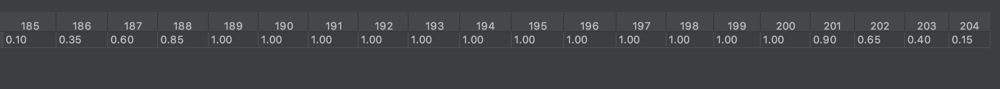

# 평판 (Reputation)

## **동기**

여러분들이 작성한 모델이 장기적으로 높은 `corr`, `mmc`, `fnc`를 달성할지는 토너먼트 시작 시점에서는 알 수 없습니다.

NMR의 페이아웃은 1회의 라운드에서의 퍼포먼스에 좌우됩니다만 리더보드에 게재되는 평판 (Reputation) 순위는 20 라운드 분의 가중평가의 평균치를 이용합니다.

## 계산방법

특정 라운드에서의 평판수는 과거 20라운드의 `corr`, `mmc`, `fnc`를 가중평균을 이용해 계산 됩니다.

각 라운드의 가중치는 토너먼트가 종료된 날을 기준으로 바뀝니다. 새로운 라운드에서는 낮은 가중치가 사용되고 라운드의 종료일에 가까워짐에 따라 가중치가 올라갑니다. 라운드 종료 시의 가중치는 1이지만 일정하게 시간이  경과함에 따라 다시 가중치가 줄어 듭니다.

아래에 가중평균을 계산하는 코드를 볼 수 있습니다.

```python
# delta is the difference between the current and target round number
def round_weight(delta, day):
  if delta <= 4:
      return (5 * delta + day) / 20
  elif delta >= 16:
      return (5 * (20 - delta) - day) / 20
  else:
      return 1
```

예를 들어 라운드 204의 3일째 평판 가중치는 다음과 같습니다.



## **예측 파일을 제출하지 않은 경우**

예측 파일이 제출되지 않을 경우 `corr`, `mmc`, `fnc`의 가중평균 계산에 페널티가 부과됩니다.

최초 제출이 늦어지거나 실패할 경우 example\_predictions과 동등한 점수가 부여됩니다. 그 이후 예측 파일이 제출되지 않은 경우 -0.1 아주 낮은 점수가 부여됩니다.

이 패널티를 피하기 위해서는 Numerai-CLI을 사용하셔서 매주 제출 워크플로우를 자동화 하시면 도움이 됩니다. 자세한 내용은 Numerai-CLI 부분에서 찾아 주세요.
