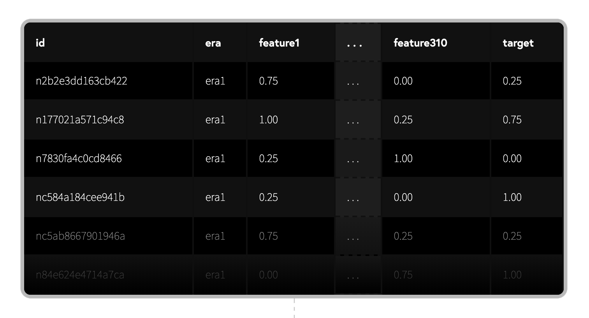
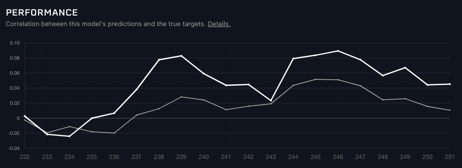
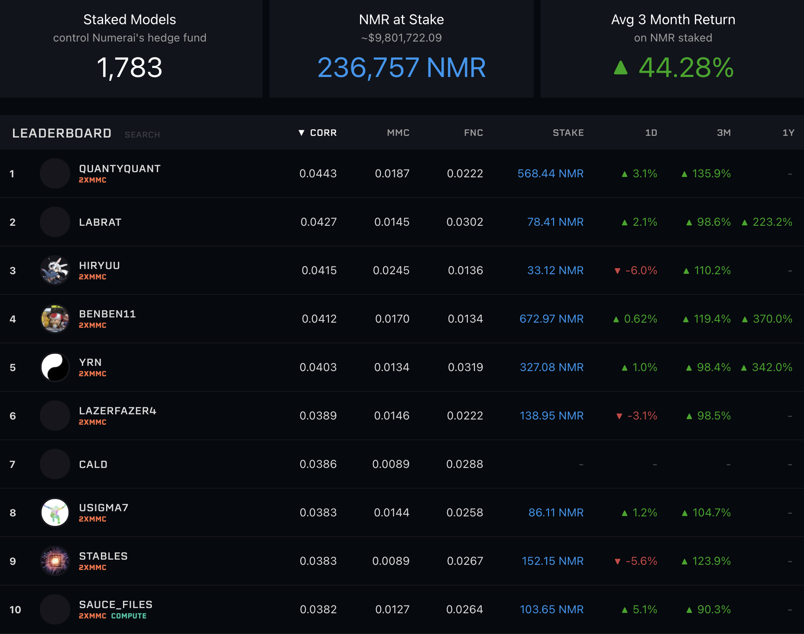

# 토너먼트 소개

## 소개

Numerai (뉴머라이) 토너먼트란 주식시장의 동향을 예측하는 모델을 만들어 적확도를 놓고 서로  경쟁하는 플랫폼입니다. 참가자는 암호화된 데이터를 사용해 기계학습 모델을 구축한뒤 예측파일을 제출해서 토너먼트에 참가할 수 있습니다.

토너먼트에 참여시 일정금액의 Numeraire (NMR - 뉴머레어) 암호화폐를 배팅할 수 있으며 그 결과에 따라 더 많은 NMR을 획득할 수 있습니다. 뉴머라이에 제출된 여러분들의 예측파일은 뉴머라이가 운용하는 헤지펀드의 모델 (메타 모델)을 설계하는 데에 사용됩니다.

밑에 유튜브 영상을 보시면 데이터가 어떤 형식으로 사용되는지 알 수 있습니다.



## **개요**

1. 뉴머라이에 등록합니다.&#x20;
2. 학습 데이터와 샘플스크립트를 포함한 데이터셋 다운로드 받습니다.&#x20;
3. 모델을 구축하고 예측치를 뉴머라이에 제출합니다.
4. 모델에 NMR을 걸면 퍼포먼스에 따른 NMR을 획득하거나 상실하게 됩니다.
5. 매주 예측파일 제출 절차를 자율화할 수 있습니다.

## 데이터

뉴머라이 토너먼트에 참여하시면 무료로 고퀄리티 금융 데이터셋을 사용할 수 있습니다. 데이터셋은 정화 후 정규화와 암호화된 고퀄리티의 재무데이터로 구성되어 있습니다.



각 `id` 는 `era` (특정 기간)의 주식명을 표시합니다. `features` (특성셋)들은 그 당시 주식의 다양한 속성들을 나타냅니다. `target` (타겟)은 향후 4주 후의 주식의 추상적인 퍼포먼스를 나타냅니다.

## 기계학습 모델링

토너먼트 안에서 여러분의 목적은 과거의 데이터를 통해 예측 모델을 작성하고 해당 모델을 사용하여 미래 주식시장을 예측하는 것입니다. 과거의 학습 데이터를 사용하여 모델을 학습시키고 live 토너먼트 데이터를 예측합니다.

파이썬의 XGBoost를 사용한 기본적인 예를 밑에 보기 바랍니다.&#x20;

```python
import pandas as pd
from xgboost import XGBRegressor

# training data contains features and targets
training_data = pd.read_csv("numerai_training_data.csv").set_index("id")

# tournament data contains features only
tournament_data = pd.read_csv("numerai_tournament_data.csv").set_index("id")
feature_names = [f for f in training_data.columns if "feature" in f]

# train a model to make predictions on tournament data
model = XGBRegressor(max_depth=5, learning_rate=0.01, \
                     n_estimators=2000, colsample_bytree=0.1)
model.fit(training_data[feature_names], training_data["target"])

# submit predictions to numer.ai
predictions = model.predict(tournament_data[feature_names])
predictions.to_csv("predictions.csv")
```

파이썬이 아니라도 참가자 개인이 선호하는 프로그래밍 언어를 자유롭게 사용 수 있습니다.

## 예측파일 제출

매주 토요일 18:00 UTC (한국시간 일요일 03:00 KST)에 새 라운드가 시작되며 새로운 토너먼트 데이터가 공개됩니다. 새 라운드에 참여하려면 그 라운드의 연관된 데이터셋를 사용해 예측값이 들어간 파일을 생성하고 뉴머라이에 제출하면 됩니다.


마감시간은 매주 월요일 14:30 UTC (한국시간 월요일 23:30 KST)입니다. 제출이 늦어질 경우 토너먼트에서 제외됩니다.

[Numerapi](https://github.com/uuazed/numerapi) (파이썬)나 [Rnumerai](https://github.com/Omni-Analytics-Group/Rnumerai) (R) 또는 [GraphQL API](https://api-tournament.numer.ai)를 사용하여 제출을 수동화 할 수 도 있습니다. 다음은 코드의 예입니다.

```python
import numerapi
napi = numerapi.NumerAPI("public_id", "secret_key")

# download data
napi.download_current_dataset(unzip=True)

# upload predictions
napi.upload_predictions("predictions.csv", model_id="model_id")
```

또는 [Numerai Compute](https://github.com/numerai/numerai-cli) 툴을 이용해 매주 예측 파일 제출을 자동화할 수도 있습니다.

```python
# setup your cloud infrastructure
numerai setup

# copy the example model
numerai docker copy-example

# deploy the example model 
numerai docker deploy
```

## 모델 진단

모델의 성능은 Diagnostics 툴을 이용하여 진단할 수 있습니다. 과거의 데이터를 기반으로 제출한 예측파일의 성능과 리스크를 진단해 주는 기능의 툴입니다.


이 진단 툴을 반복적으로 사용하면 과적합화 될 수 있습니다. 본 툴은 최종 확인용으로만 사용하는 것이 좋습니다.



더 자세한 내용은 [이 게시판에 글](https://forum.numer.ai/t/model-diagnostics-update/902)을 참고해 주세요.

## 모델의 평가방법

참가자가 제출한 예측치는 모델의 예측과 타겟 사이의 스피어만등위상관계수(`corr`)로 스코어가 측정 됩니다. 상관성이 높을수록 높은 페이아웃을 받을 수 있습니다.



```python
# method='first' breaks ties based on order in array
ranked_predictions = predictions.rank(pct=True, method="first")
correlation = np.corrcoef(labels, ranked_predictions)[0, 1]
```



예측치는 메타 모델 공헌도 (`mmc`) 와 특성중립화 상관계수 (`fnc`)에 대해서도 스코어가 매겨집니다. 이 두 수치에 대한 자세한 내용은 각 수치의 페이지를 참조해 주세요.\
\
예측치는 매주 라운드가 시작된 후 4주에 걸쳐 평가됩니다. 라운드 마감 후 다음주   요일에 첫 평가를 받고 4주 후 수요일에 최종 스코어를 받습니다.


라운드가 종료되기까지 약 4주가 소요되므로 매주 새로운 예측 파일을 제출하면 각 평가일에 여러 개 (최대 4개)의 평가를 받을 수 있습니다.


모델 live 스코어는 프로필 페이지에 공개되어 있습니다. 아래에 있는 그래프는 과거 20 라운드에 걸치는 모델의 최종 스코어를 보여주고 있습니다.



특정 라운드에 줌인하여 라운드 내의 하루하루 변경된 스코어를 확인할 수 있습니다.&#x20;


## 스테이킹

매주 라운드에 참가자는 자신의 예측치에 NMR을 베팅할 수 있습니다. 뉴머라이는 NMR로 스테이킹된 액수가 많을수록 참가자가 자신의 예측에 확신을 가지고 있다고 봅니다. 뉴머라이는 참가자에게서 정확한 예측치를 구하고 정확한 예측에 대해서는 높은 보상으로 보답합니다.

라운드당 얻을 수 있는 NMR 금액은 스테이킹 양과 그 라운드 예측치의 `corr`과 `mmc`의 수치에 결정 됩니다.  현재 `fnc` 수치에는 스테이킹이 가능하지 않습니다. NMR의 페이아웃은 스테이 양에 비례하기 때문에 복수의 계정을 만드는것 만으로는 많은 페이아웃을 얻을 수 없습니다.

물론 NMR을 스테이킹이 없이도 토너먼트에 참여할 수 있습니다. 예를 들어 토너먼트의 세부 사항이나 자신의 모델의 성능을 측정하기 위해서 NMR을 스테이킹 하지 않은 채 예측 파일만 제출하는 것도 가능합니다. 참가자가 자신의 모델에 확신을 갖게 되면 그 때 스테이킹을 해도 됩니다.

뉴머라이 웹사이트에서는 "Manage Stake"를 클릭해서 스테이킹 양을 관리할 수 있습니다. 이 기능을 사용하면 NMR의 스테이킹 금액을 인상 또는 인하 하거나 페이아웃을 `corr`, `corr`+1/2 `mmc`, `corr`+`mmc`, `corr`+2 `mmc`에 베팅할 수 있습니다.


스테이킹은 NMR을 이더리움 블록체인의 스마트 컨트랙트에 고정하는 것을 의미합니다. 스테이킹중 뉴머라이는 락업된 NMR을 증가/소멸 시킬 수 있는 권리를 갖습니다.

NMR의 스테이킹 금액을 늘리면 참가자의 지갑에서 NMR이 인출되고 뉴머라이가 보유한 계정으로 NMR이 이체됩니다. 반대로 NMR의 스테이킹 금액을 줄이면 뉴머라이가 보유한 계정에서 NMR이 이체되어 참가자의 지갑으로 입금됩니다.

스테이킹 양에 대한 인하은 바로 적용되는 것이 아니라 4주 후에 반영됩니다. 이는 토너먼트 라운드 종료 기간이 4주 동안인 것 기인합니다.

## 페이아웃

라운드당 얻을 수 있는 NMR 금액은 스테이킹 양과 그 라운드 예측치의 `corr`과 `mmc`의 수치에 의해 결정 됩니다. **** 수치가 높으면 높을수록 더 많은 NMR을 얻을 수 있습니다. 만약 수치가 마이너스 `corr` 또는 `mmc`가 되었을 경우 스테이킹 된 NMR의 일부가 소멸되어 burn (번)됩니다. 번은 ERC-20 토큰이 가진 기능 중 하나로 토큰을 영원히 사용할 수 없게 소멸시키는 기능을 말합니다. 페이아웃 되는 NMR의 양은 스테이킹 금액의 ±25%로 제한하고 있습니다.

페이아웃은 이하의 공식으로 계산됩니다.

```
payout = at_risk_stake * payout_factor * (corr * corr_multiplier + mmc * mmc_multiplier)
```

`stake_value` : 라운드 시작 시점의 첫 번째 목요일에 스테이킹 한 NMR의 금액

`payout_factor`: 30만 NMR 이하에서는 1이며 30만 NMR 이상에서는 이하의 차트에 나타내는 수치에 반영된 액수가 되겠습니다. 뉴머라이는 페이아웃 상한선을 정하고 조정함으로써 지속적으로 토너먼트를 개최할 수 있습니다.


`corr`: 제출한 예측치와 타겟의 상관계수

`corr_multiplier`: 현재는 1.0x 이외는 선택할 수 없습니다

`mmc`: 제출한 예측치와 메타모델과의 상관계수

`mmc_multiplier`: 현재 0.5x, 1.0x, 2.0x 중 하나를 선택할 수 있습니다

`payout_factor`의 수치나 `corr_multiplier`과 `mmc_multiplier`의 선택권은 뉴머라이에 결정에 의해 변경될 가능성이 있습니다

아래는 페이아웃 계산의 예를 보여줍니다. 첫 두 줄는 `corr_multiplier`의 영향을 나타내고 있습니다. 세 번째 예시는 마이너스 스코어가 페이아웃에 영향을 미치는지 보여줍니다. 네 번째 예시는 페이아웃이 스테이크 양의 ±25%로 제한되어 있음을 보여줍니다.

| stake value | payout factor | corr  | corr\_multiplier | mmc   | mmc\_multiplier | payout    |
| ----------- | ------------- | ----- | ---------------- | ----- | --------------- | --------- |
| 100 NMR     | 0.8           | 0.02  | 1.0x             | 0.002 | 2.0x            | 1.92 NMR  |
| 100 NMR     | 0.8           | 0.02  | 1.0x             | 0.002 | 0.0x            | 1.6 NMR   |
| 100 NMR     | 0.8           | -0.03 | 1.0x             | 0.002 | 0.5x            | -2.32 NMR |
| 100 NMR     | 0.8           | 0.15  | 1.0x             | 0.1   | 2.0x            | 25 NMR    |

점수는 매일 갱신되지만 페이아웃은 라운드 종료일 (한국시간 금요일) 에만 진행됩니다. 참가자 커뮤니티에서 제공하는 NumeraiPayouts앱을 사용하시면 페이아웃 예상 수치의 변화를 실시간 추적할 수 있습니다.

스테이킹을 시작하면 4라운드 동안 스테이킹 금액은 일정하게 유지됩니다. 그 후 4주 전 라운드의 지불에 따라 스테이킹 수치가 매주 갱신됩니다.


지속적으로 높은 스코어를 달성하면 얻을 수 있는 NMR의 금액은 점차적으로 증대합니다. 모델이 52주 동안 매주 같은 점수를 받는다고 가정했을 때 최종 NMR 금액 예측은 아래에 차트를 보기 바랍니다.


## 리더보드

리더보드에 게재되는 평가나 순위는 20 라운드동안의 `corr`, `mmc`와 `fnc`의 가중평균치를 나타냅니다. 자세한 내용은 평판 (Reputation) 페이지를 참조해 주세요.



## 도움요청

도움이 필요하신가요?

질문과 피드백은 [RocketChat](https://community.numer.ai/home) (영어) 또는 [Slack](https://join.slack.com/t/numerai-kr/shared\_invite/zt-1009d7ws3-hWRKdy8EkbSzwwzxaURlQw)(한국어)에 올려 주시기 바랍니다!
